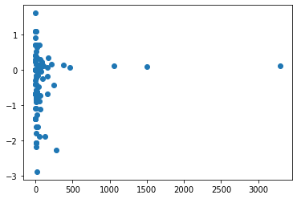
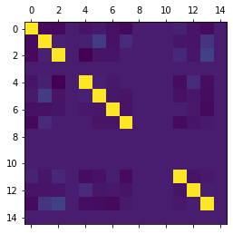
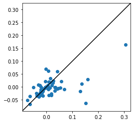
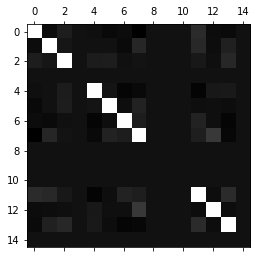
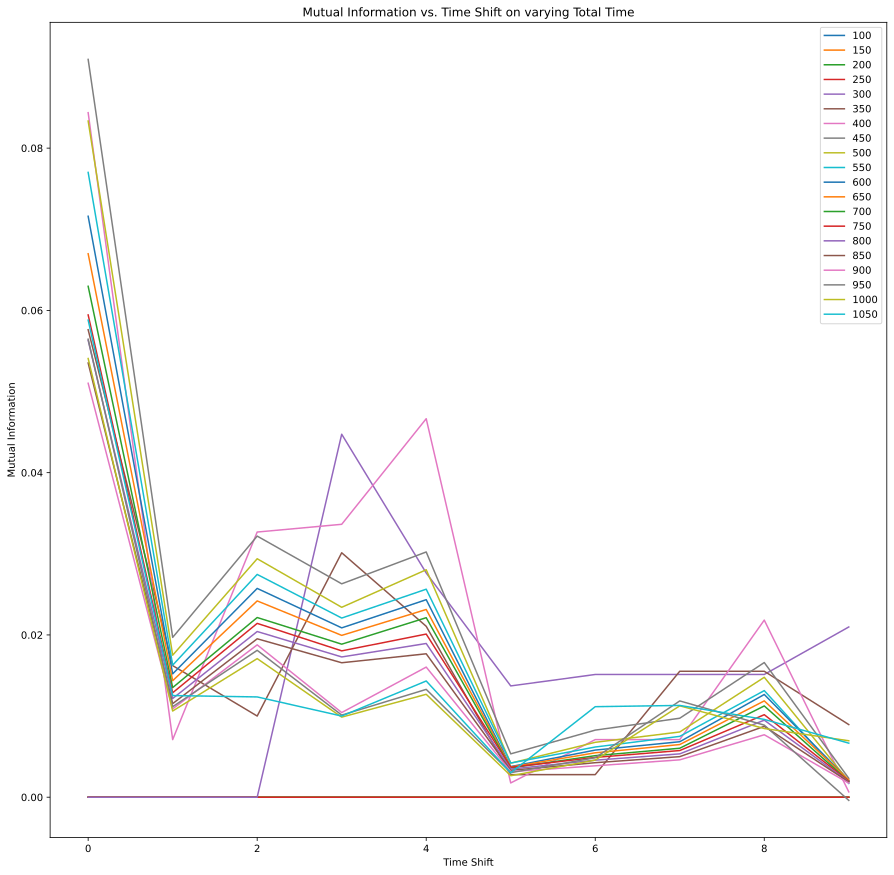

# Google Summer of Code 2021 
## HDNet-INCF
---

## Analyzing stimulus prediction capabilities of neurons: predictive information estimation methods
---
## Mentors:

* ### Prof. Sarah Marzen
* ### Dr. Chris Hillar
## Student:
* ### Shiven Tripathi
---
## Summary

### From Proposal:

To guide behaviour, it has been proposed that neurons eventually learn to predict future states of sensory inputs. The project mentors have worked in this direction to get metrics on these predictions about how accurate those predictions are if the neuron used synaptic learning rules. The main contribution of this project would be to publish highly optimised library codes that can serve as evaluation benchmarks for predictive accuracy. We also believe that neurons can generate efficient encodings on these predictions. Through this project, estimates of the predictive information would also be obtained by neural models.

### Implementations in Coding Period:

The project started with a literature review of the current models used to understand spike train data. Before any analysis can be conducted, fitted models need to be validated and therefore prevalent validations in the literature were implemented as part of the hdnet codebase. 

After this work, the project was extended to adding more utilities to hdnet codebase like dataloaders, samplers and calculation of other statistics which are useful for spiketrain data. HDNet's existing sampler for Ising Models used Gibbs sampling which was found to not work for spike train data with high number of neurons. The added Metropolis Sampler has been tested to work with higher dimensional data and generates samples much faster than Gibbs Sampler. Also, to capture higher order interaction effects between neurons, the N<sup>th</sup> Order interaction calculation was added which can be used to calculate upto 3<sup>rd</sup> order correlations. 

Several existing codebases relevant to analysis of spike train data have been coded in MATLAB which makes a direct use with HDNet challenging. Through this project an extension to HDNet, HDNet Contrib was developed which can provide an interface to these MATLAB codebases. An example of such enhanced functionality is available in the form of Py-CDM Entropy, which builds a wrapper over the existing MATLAB codebase of CDM Entropy. Also an extension over CDM entropy is provided in HDNet Contrib which can be used to calculate the predictive information of a neurons with mutual information estimates.

---
## Source Codes

### 1. [hdnet](https://github.com/ShivenTripathi/hdnet)
1. [Validation : spikes_model_validation.py](https://github.com/ShivenTripathi/hdnet/blob/master/hdnet/spikes_model_validation.py) 
    * New module of spikes_model_validation.py written for hdnet
    * Objects for validation of spike train data present in the module
    * Implemented: 
        * Log Probability Ratio:
            * Returns dictionary mapping to ratios of log probabilities for codewords in two spike trains
        * Most Frequent Common Code Words:
            * Returns list of common code words among most frequent codewords of two spike trains

2. [Spike Train Statistics : spikes.py](https://github.com/ShivenTripathi/hdnet/blob/master/hdnet/spikes.py)

    * Code added as member functions of existing Spikes Object in HDNet
    * Added functions for calculating statistics and information about spike train data
    * Implemented:
        * Code Word Frequencies:
            * This helps in calculating the most frequent code words in a spike train data as a validation
            * Returns counter object containing the count of the number of times a code word is present in a spike train
        * Normalise Spike Train to Mean 0 and Variance 1
            * This utility is useful when calculating higher order statistics for spike train data
        * N<sup>th</sup> Order Statistics (mean, correlations and so on):
            * This can also be used as a validation metric  

3. [Sampling : sampling.py](https://github.com/ShivenTripathi/hdnet/blob/master/hdnet/sampling.py)
    * Existing HDNet Sampler for Maximum Entropy Models used Gibbs sampling 
    * For validation when fitted parameters are known, Metropolis Sampler can be used to generate a spike train with which validation is performed
    * Implemented:
        * Metropolis Sampler for Spike Train data from fitted parameters (Js and Thetas) of a Maximum Entropy model
        * Number of samples can be set by the user to generate spike train with appropriate time steps

### 2. [hdnet_contrib](https://github.com/ShivenTripathi/hdnet_contrib)

1. Interface with MATLAB codebases
    * hdnet_contrib provides an example to interface with MATLAB codebases using HDNet. Python wrappers can be easily built using oct2py, allowing easy access inside python code
    * The example of Py-CDM Entropy can be used as a sample interface, and many more such additions can be made. All of these interfaces can be installed as a library improving accessibility

2. [Py-CDM Entropy : CDMentropy.py](https://github.com/ShivenTripathi/hdnet_contrib/blob/main/hdnet_contrib/CDMentropy.py)

    * A wrapper for the existing MATLAB codebase of CDM Entropy enhanced with methods to caclulate mutual information.
    * Object oriented design encapsulating functions for calculating entropies and mutual information for windowed time bins on spiketrain data.
---
## Demos

### 1. [hdnet](https://github.com/ShivenTripathi/hdnet)
1. [Validation and Statistics](https://github.com/ShivenTripathi/hdnet/blob/master/examples/demoValidation.ipynb): 
    * Frequency of code words
        ```python
        true_spikes.get_frequencies()
        
        Counter({'000000000000000': 335, '000010000000000': 172, '000000000000010': 99, , '010000000000000': 17, '001010000000000': 17, '000000010000000': 16, '010010000000000': 11, '100000000000010': 11, '000000100000000': 9, '000010000001000': 8, '000000010000010': 8, '010000000000010' ........}
        ```
    * Log Probability Ratio
        ```python
        logp = hdnet.spikes_model_validation.LogProbabilityRatio(
        true_spikes,pred_spikes)
        logp.call()
        {'000000000000010': 0.0, '000000100000010': -0.6931471805599453, '000000000000000': 0.1708690630621668, '000010100000000': -1.0986122886681098, '000010000001010': -2.0794415416798357, '000000000001000': -0.16034265007517937, '010010010000000': -1.0986122886681098, '001000000001010'.....}
        ```

        Plot of log probability ratio vs frequencies in spike trains

        

    * Most Frequent Common Code Words
        ```python
        freqc = hdnet.spikes_model_validation.MostFrequentCommonCode(true_spikes,pred_spikes)
        print("Common Codes: "+str(len(freqc.call(500)))+" in Top 500 Codes")
        Common Codes: 101 in Top 500 Codes
        ```
    * Nth Order Statistics
        ```python
        second_order = pred_spikes.NOrderInteractions(N=2)
        plt.matshow(second_order[0])
        ```
        

        Plot of second order statistics in true and fitted spike trains

        
2. [Sampling](https://github.com/ShivenTripathi/hdnet/blob/master/examples/demoMetropolisSampler.ipynb): 
    * Metropolis Hastings Sampler 
        ```python
        samples = hdnet.sampling.sample_from_ising_metropolis(J=0.5*Js[0,:NEURONS,:NEURONS], 
        theta=-thetas[0,:NEURONS], k=0.01, burn_in=BURN_IN,num_samples=NUM_SAMPLES)

        print(samples)

        <Spikes: 15 neurons, 30000 bins, 1 trials>
        ```

        Second Order Interactions in spike train generated using Metropolis Sampler (observe it agrees with previous results)

        
### 2. [hdnet_contrib](https://github.com/ShivenTripathi/hdnet_contrib)
1. [CDM Entropy](https://github.com/ShivenTripathi/hdnet_contrib/blob/main/examples/PyCDMentropy/demoCDME.ipynb): interface with HDNet
    * CDM Entropy
        ```python
        cdme = CDMentropy(spikes=true_spikes)
        e = cdme.entropyCDM(trial=0,time_start=0, neuron_start=0, time_end=500, neuron_end=50)
        print("Entropy",e)

        Entropy 5.8832817305175915
        ```
    * CDM Entropy Mutual Information predictive estimate
        ```python
        cdme = CDMentropy(spikes=true_spikes)
        I = cdme.mutualInformationWindowed(trial=0, time_start=0, neuron_start=0, stimulus_start=60, tau=5, time_end=5000, 
            neuron_end=30, stimulus_end=61)
        print("MI",I)

        MI 0.0029785186396491525
        ```

        Plot of Mutual Information estimate vs Time Shift on varying total time steps

    
---
## References
* Archer E, Park I, & Pillow JW (2013). Bayesian entropy estimation for binary spike train data using parametric prior knowledge. Advances in Neural Information Processing Systems 26, 1700-1708
* Ilya Nemenman, Fariel Shafee, and William Bialek. 2001. Entropy and inference, revisited. In Proceedings of the 14th International Conference on Neural Information Processing Systems: Natural and Synthetic (NIPS'01). MIT Press, Cambridge, MA, USA, 471–478.
* Liam Paninski. 2003. Estimation of entropy and mutual information. <i>Neural Comput.</i> 15, 6 (June 2003), 1191–1253
* Granot-Atedgi, Einat et al. “Stimulus-Dependent Maximum Entropy Models of Neural Population Codes.” Ed. Olaf Sporns. PLoS Computational Biology 9.3 (2013): e1002922. Crossref. Web.
* Schneidman, E., Berry, M., Segev, R. et al. Weak pairwise correlations imply strongly correlated network states in a neural population. Nature 440, 1007–1012 (2006)
* Tkačik, Gašper et al. “The Simplest Maximum Entropy Model for Collective Behavior in a Neural Network.” Journal of Statistical Mechanics: Theory and Experiment 2013.03 (2013): P03011. Crossref. Web.